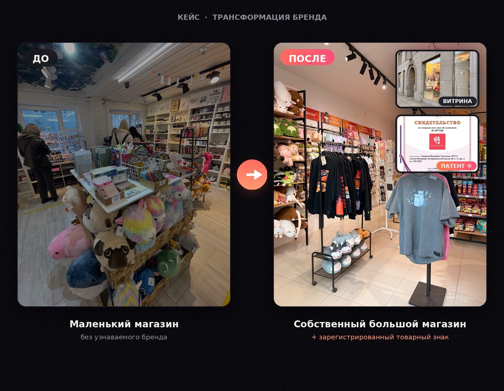

# Как пользоваться сайтом

## Структура
- `index.html` — главная страница (обложка, профиль, цифры, сетка кейсов, стек, образование, контакты)
- `case-01.html` … `case-10.html` — отдельная страница на каждый кейс
- `styles.css` — все стили сайта в одном файле
- `images/` — папка для ваших скриншотов
- `build_cases.py` — служебный скрипт, которым сгенерированы страницы кейсов (не обязателен для работы сайта, можно удалить)

## Как добавить реальные скриншоты
Сейчас в каждом кейсе вместо фото — пунктирные плейсхолдеры с подписью, что за скриншот там должен быть.

1. Положите фото в папку `images/`, например `images/case-01-1.jpg`.
2. Откройте нужный `case-XX.html` в любом текстовом редакторе (можно прямо в блокноте).
3. Найдите блок вида:
```html
<div class="shot"><span>До / после визуальной коммуникации бренда...</span></div>
```
4. Замените его на:
```html
<div class="shot"></div>
```
5. Сохраните файл и обновите страницу в браузере — фото подставится и красиво обрежется под рамку.

Повторите для каждого скриншота в каждом кейсе. Рекомендованное соотношение сторон фото — примерно 4:3 (например 1200×900 px), тогда обрезка будет аккуратной.

## Как посмотреть сайт локально
Просто откройте `index.html` двойным кликом — он откроется в браузере. Ссылки между страницами будут работать, потому что все файлы лежат в одной папке.

## Как опубликовать (сделать доступным по ссылке)
Проще всего — бесплатно на Vercel или Netlify:
1. Зарегистрируйтесь на vercel.com или netlify.com (можно через GitHub).
2. Перетащите всю папку с сайтом в окно загрузки на сайте сервиса (drag-and-drop деплой, без кода).
3. Через минуту получите публичную ссылку вида `ваш-сайт.vercel.app`.

Альтернатива — GitHub Pages: создать репозиторий, загрузить туда все файлы, включить Pages в настройках репозитория.

## Как добавить/убрать кейс
- Чтобы убрать кейс — удалите соответствующую карточку `<a class="case-card" ...>...</a>` в `index.html` и не ссылайтесь на файл `case-XX.html`.
- Чтобы добавить новый — проще всего скопировать один из существующих `case-XX.html`, переименовать в `case-11.html`, поменять текст внутри, и добавить на него карточку-ссылку в `index.html` в блоке `<div class="cases-grid">`.

## Как поменять контакты / VK-ссылку
Ссылка на VK сейчас стоит как `href="#"` — замените на настоящую ссылку на профиль в `index.html` (2 места) и в `case-XX.html`, если нужно.
